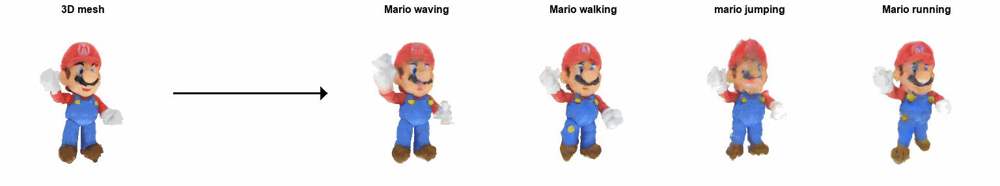

# Bringing Objects to Life: 4D generation from 3D objects
<a href="https://3-to-4d.github.io/3-to-4d/"></a>
<a href=""></a>
<a href="https://www.apache.org/licenses/LICENSE-2.0.txt"></a>
<!-- Official implementation. -->
<br>
<p align="center" style="display: flex; justify-content: center; flex-wrap: nowrap; gap: 10px;">
    <figure style="text-align: center; margin: 1px;">
        
    </figure>
</p>

> <a href="https://3-to-4d.github.io/3-to-4d/">**Bringing Objects to Life: 4D generation from 3D objects**</a>
>
<a href="https://ohadrahamim.github.io/">Ohad Rahamim</a>,
<a href="">Ori Malca</a>,
<a href="https://chechiklab.biu.ac.il/~dvirsamuel/">Dvir Samuel</a>,
<a href="https://chechiklab.biu.ac.il/~gal/">Gal Chechik</a>
><br>
>  Our method receives an input 3D model - like a model of your Mario figure, and a textual prompt - like ``Mario Running". Our goal is to animate the object, generating a 4D scene that reflects the described action in the prompt, yielding a 4D object of your favorite flower blooming. 
</p>

# Installation
Install the conda virtual environment:
```bash
conda create -n animate python=3.9
conda activate animate
TCNN_CUDA_ARCHITECTURES=80 pip install git+https://github.com/NVlabs/tiny-cuda-nn/#subdirectory=bindings/torch # for A100
pip install ninja git+https://github.com/NVlabs/tiny-cuda-nn/#subdirectory=bindings/torch
conda install pytorch==2.2.2 torchvision==0.17.2 torchaudio==2.2.2 pytorch-cuda=11.8 -c pytorch -c nvidia
conda install -c "nvidia/label/cuda-11.8.0" cuda-toolkit
conda install -c fvcore -c iopath -c conda-forge fvcore iopath
conda install pytorch3d -c pytorch3d
pip install -r requirements.txt
pip install -U xformers --index-url https://download.pytorch.org/whl/cu118
```

# Generate a 4D scene
Our model is trained in 2 stages, while the first can be shared between different prompts.
Every different prompt requires a new training of the second stage.
We provided two configs for every stage.

```sh
    # Stage 1
    python launch.py --config custom/configs/3to4D-stage1.yaml --train --gpu 1 exp_root_dir=outputs seed=0 data.image.object_path=\path\to\your\mesh.obj system.prompt_processor.prompt="your desiered action"
    
    # Stage 2
    python launch.py --config custom/configs/3to4D-stage2.yaml --train --gpu 1 exp_root_dir=outputs seed=0 data.image.object_path=\path\to\your\mesh.obj system.prompt_processor.obj_token_clip_idx=\the\word\location\in\the\prompt system.prompt_processor.prompt="your desiered action"
```

## Citation
If you find this useful for your research, please cite the following:
```bibtex

```